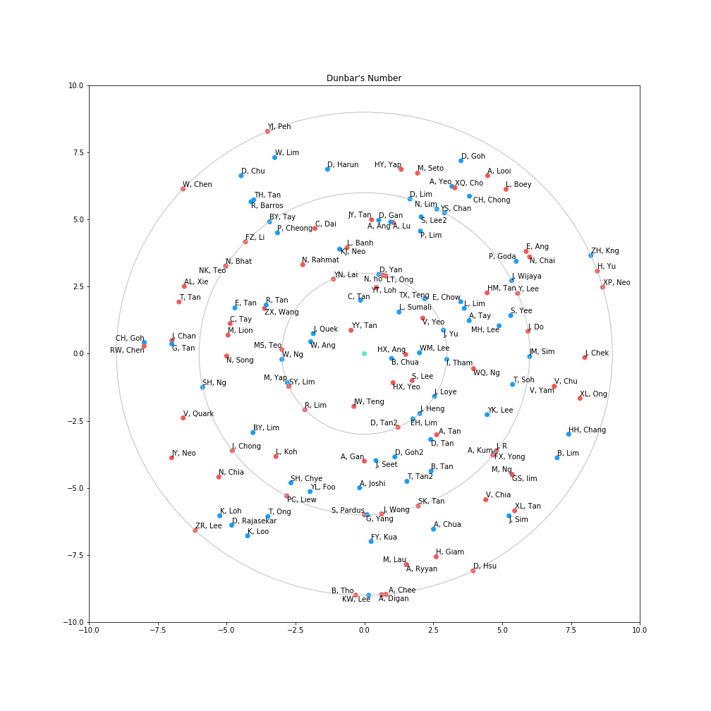

# Dunbar's Number

Suggest a cognitive limit to the number of connection one can maintain a stable relationship. Here stable is defined as follows:
1. Able to identify the person's full name
2a. Maintained contact in the last one year OR
2b. One does not feel awkward calling the other party out in the public

Evidently, 150 is the magic number.

